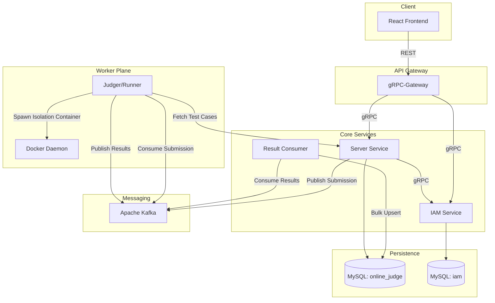

# Online Judge

A scalable, high-performance, and secure microservices-based Online Judge system. Designed to compile and execute untrusted code in isolated environments, manage complex permissions across groups, and handle high submission volumes through asynchronous batch processing.

## 🚀 Key Features

- **Multi-Language Support**: Compile and run code in Go and C++ using isolated Docker containers.
- **Hybrid IAM**: Granular permission system supporting both Global roles and Scoped roles (e.g., a student can be an Admin of a specific group).
- **Resource Constraints**: Enforce per-problem Time Limits (ms) and Memory Limits (MB).
- **Intelligent Judging**: 
  - **Run Mode**: Quickly test code against public sample test cases.
  - **Submit Mode**: Official evaluation against the full test suite.
- **High Performance**: `result-consumer` uses an **Async Drain & Flush** pattern to batch database updates.
- **Modern UI**: React-based dashboard with a real-time console, problem management, and personal portfolios.

## 🏗 Architecture



### Component Details
*   **IAM Service**: The source of truth for identity. Centrally manages users, roles, and permissions. Uses gRPC interceptors for secret-less token introspection.
*   **Server Service**: Manages problems, test cases, and metadata. Acts as the entry point for submissions.
*   **Judger (Runner)**: Scalable worker that manages the execution lifecycle (Compile -> Run -> Notify). Communicates with the host Docker socket to create short-lived isolation containers.
*   **Result Consumer**: Decoupled worker that buffers execution results and flushes them to the database in bulk to maximize throughput.

## 🛠 Tech Stack

- **Backend**: Go (Golang), gRPC, Protobuf, Viper, Cobra, GORM.
- **Frontend**: React, TypeScript, Vite, Tailwind CSS, Lucide React.
- **Infrastructure**: Apache Kafka, MySQL, Docker, Docker Compose, Bazel (optional).

## 🚦 Getting Started

### 1. Prerequisites
- Docker & Docker Compose
- Node.js & Yarn (for local frontend development)
- Go 1.25+ (for local backend development)

### 2. Setup Environment
Copy the example environment file and customize as needed:
```bash
cp .env.example .env
```

### 3. Start Infrastructure & Services
Run everything in one command:
```bash
docker-compose up -d
```
This will:
1. Initialize MySQL with two databases (`online_judge` and `iam`).
2. Start Kafka KRaft.
3. Run all microservices and the frontend dashboard.
4. Automatically apply database migrations.

### 4. Access the Platform
- **Frontend**: [http://localhost:3000](http://localhost:3000)
- **IAM API**: [http://localhost:8080](http://localhost:8080)
- **Core API**: [http://localhost:8081](http://localhost:8081)
- **Kafka UI**: [http://localhost:8085](http://localhost:8085) (If enabled)

## 📂 Project Structure

```text
├── src/
│   ├── apps/
│   │   ├── frontend/        # React + Vite application
│   │   ├── backend/
│   │   │   ├── iam/         # Identity & Access Management
│   │   │   ├── server/      # Core logic & Result management
│   │   │   └── runner/      # Judger (execution worker)
│   └── packages/
│       ├── iam/             # Shared Auth middleware
│       ├── kafka/           # Shared Event schemas
│       ├── proto/           # Protobuf definitions & generated code
│       └── database/        # Shared DB provider
├── docker/                  # Infrastructure config (MySQL init scripts)
└── docker-compose.yml       # Orchestration
```
